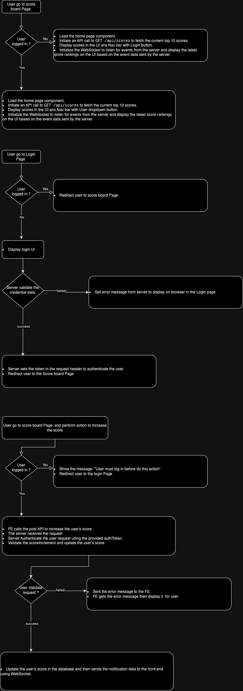

# Scoreboard API Service

This module is responsible for managing and updating the scoreboard on our website. It includes live updates for the top 10 user scores and handles score updates securely.

## Overview

### Purpose

Provide live updates for the top 10 user scores and securely handle score updates.

### Functionality

- **Retrieve the top 10 user scores.**
- **Update scores upon user action completion.**
- **Ensure score updates are authorized and prevent malicious manipulation.**

# API Endpoints

## 1. Get Top 10 Scores

- **Endpoint:** `GET /api/scores`
- **Description:** Retrieve the top 10 user scores.
- **Response:**

  ```json
  {
    "scores": [
      {"userId": "user1", "score": 1500},
      {"userId": "user2", "score": 1400},
      ...
    ]
  }


## 2. Update Score

- **Endpoint:** `POST /api/scores/update`
- **Description:** Update a user’s score. This endpoint is triggered when a user completes an action.

- **Request Body**
```json
{
  "userId": "user1",
  "scoreIncrement": 100,
  "authToken": "user-auth-token"
}
```

- **Response Body**
```json
{
  "success": true,
  "message": "Score updated successfully"
}
```

# Security

### Authorization

- Use an `authToken` to validate the user’s identity and ensure they are authorized to update the score.
- Implement token-based authentication (e.g., JWT) to verify the `authToken`.

### Validation

- Validate the `userId` and `scoreIncrement` values to prevent unauthorized or invalid updates.
- Implement rate limiting to prevent abuse.

# Live Update

### WebSocket Integration

- Use WebSocket to push live updates to the client for score changes.

### Client-Side

- Ensure the client subscribes to WebSocket events to receive real-time updates.

# Error Handling

### Error Responses

- **Invalid Token:** `401 Unauthorized`
- **Invalid Score Increment:** `400 Bad Request`
- **User Not Found:** `404 Not Found`


## Comments for Improvement

### Scalability

- **Consider caching** the scores for quick retrieval and reducing database load.
- **Implement a strategy** for handling large-scale live updates, such as using message brokers or pub/sub systems.

### Security Enhancements

- **Implement IP whitelisting** or additional verification steps for high-risk score updates.
- **Regularly review and update** authentication and authorization mechanisms.

### Testing

- **Create comprehensive unit and integration tests** to ensure the API handles edge cases and potential security vulnerabilities.

### Documentation

- **Keep the API documentation updated** with any changes to endpoints, request parameters, or response formats.

## Diagram Flow


